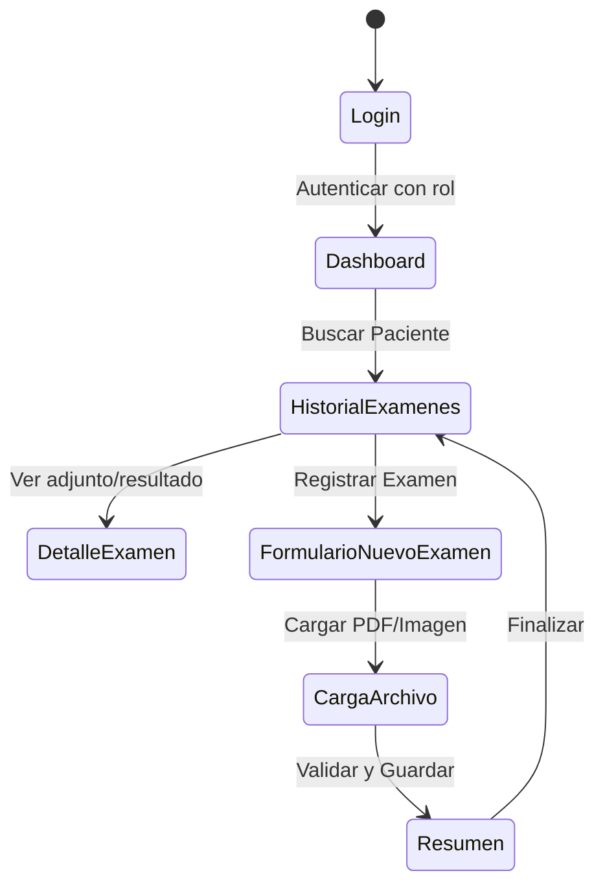

# OftApp - Trazabilidad y Consulta de Exámenes Oftalmológicos

## Propósito del Proyecto
OftApp es un MVP móvil desarrollado en Android (Kotlin + Jetpack Compose) para la asignatura DSY1105. Su objetivo es centralizar, ordenar y brindar trazabilidad a los exámenes oftalmológicos (campimetría, topografía, agudeza visual) mediante datos ficticios y simulados, optimizando la consulta histórica para profesionales y pacientes.

## Identidad Visual
- **Logotipo:** `docs/diseno/logo.png`
- **Paleta de Colores:**
  - Azul Principal: `#0066CC`
  - Verde Secundario: `#00A896`
  - Fondo: `#F8F9FA`
  - Texto: `#1A1C1E`

## Flujo de Usuario (UML)

## Pantallas Principales
1. Login (`docs/diseno/interfaces/01_login.png`)
2. Dashboard (`docs/diseno/interfaces/02_dashboard.png`)
3. Historial de Exámenes (`docs/diseno/interfaces/03_historial.png`)
4. Detalle de Examen (`docs/diseno/interfaces/04_detalle.png`)
5. Registro de Examen (`docs/diseno/interfaces/05_registro.png`)
6. Carga de Documento (`docs/diseno/interfaces/06_carga_archivo.png`)
7. Resumen (`docs/diseno/interfaces/07_resumen.png`)

## Integrantes
- Eduardo Saldivia (Diseñador UI/UX y Desarollador Backend)
- Antonio Sepulveda (Diseñador UI/UX y Desarollador Backend)

## Tecnologías Utilizadas
- Kotlin & Jetpack Compose
- Material Design 3
- Arquitectura MVVM (Model-ViewModel-UI)
- Persistencia Local (Room / DataStore)
